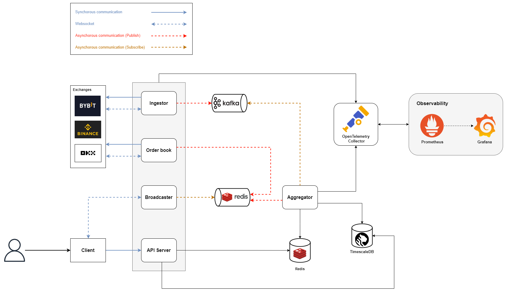
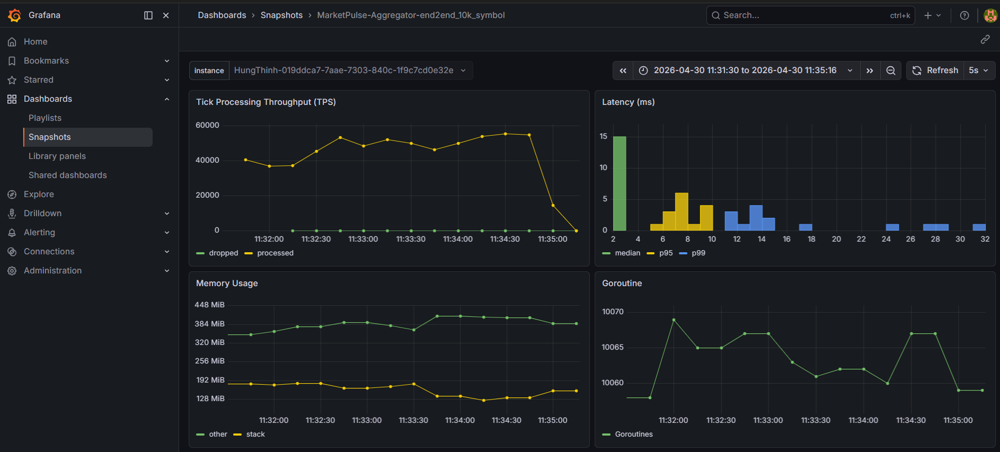
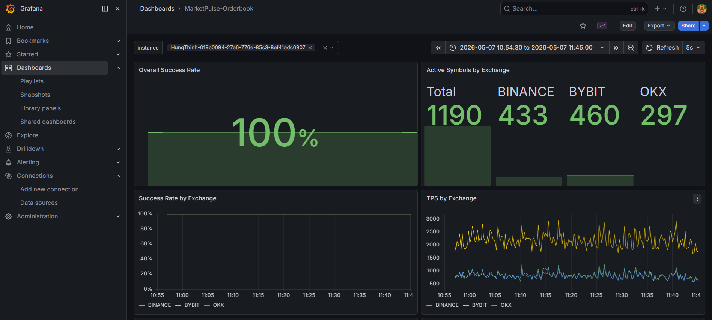
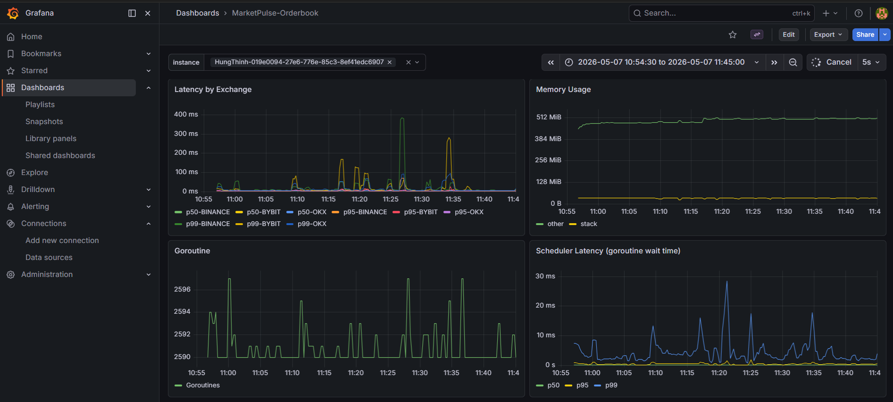
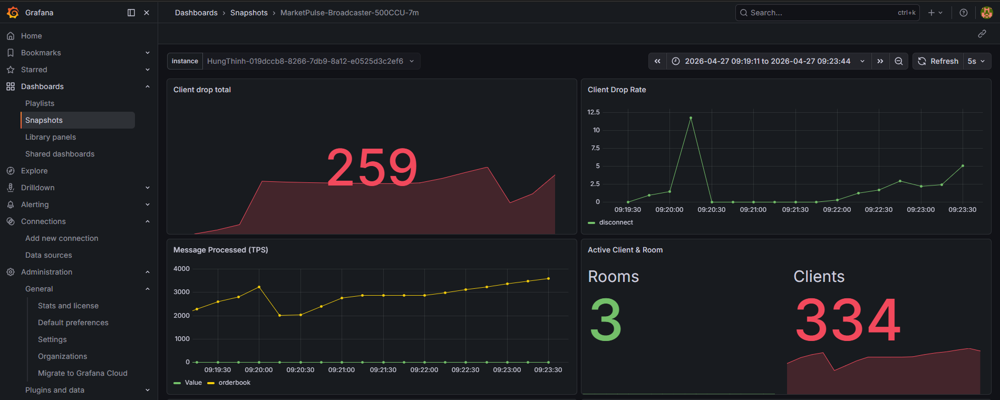
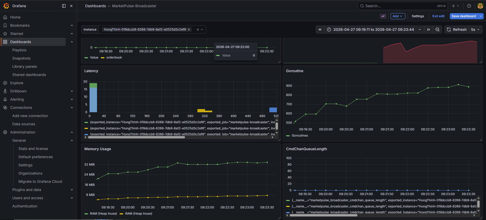

# MarketPulse

> Real-time crypto market data aggregator — streaming live candles, trades, and order book updates from multiple
> exchanges with sub-second latency.

Built as a deep-dive into high-throughput data pipeline design: dual-pipeline architecture, sub-second latency from
exchange to browser, and observable-by-default infrastructure.

---

## Tech Stack

| Layer               | Technology                               |
|---------------------|------------------------------------------|
| Language            | Go (1.25.8)                              |
| Message Broker      | Apache Kafka                             |
| Realtime Pub/Sub    | Redis                                    |
| Candle Cache        | Redis                                    |
| Time-series Storage | TimescaleDB (PostgreSQL extension)       |
| Observability       | OpenTelemetry · Prometheus · Grafana     |
| Exchange APIs       | Bybit · Binance · OKX (WebSocket + REST) |

---

## Architecture Overview


*MarketPulse — dual-pipeline system design*

---

## Technical Highlights

- **Dual-pipeline design** — Candle/trade data flows through Kafka → Aggregator for processing and persistence; Order
  Book updates bypass Kafka entirely and go straight to Redis Pub/Sub, optimizing latency per data type
- **Live candle construction** — Aggregator builds & maintains multiple OHLCV candle timeframes in real-time from raw
  trade events, writing to Redis Cache (live candle) and TimescaleDB (historical) simultaneously
- **Historical Chart Data API** — Provides a fast, paginated REST API for historical candlesticks.
  Utilizes a hybrid approach: Redis Cache-Aside for instant hits, falling back to TimescaleDB for deeper history.
- **Multi-exchange Ingestion** — Concurrently connects to and normalizes real-time data from
  top-tier exchanges (Binance, OKX, Bybit) via WebSockets by using Anti Corruption Layer (ACL) design pattern.
- **Self-Healing State Recovery** — Automatically detects order book gap (corruption) in exchange data,
  intelligently drops the corrupted state, and triggers resync logic without system downtime.

---

## System Architecture

MarketPulse runs two independent data pipelines:

### Pipeline 1 — Candle & Trade Data

```
Exchange (WS) → Ingestor → Kafka → Aggregator → TimescaleDB (historical)
                                              └→ Redis Cache (live candle)
                                              └→ Redis Pub/Sub → Broadcaster → Client (WS)
```

The Ingestor connects to each exchange via WebSocket, normalizes raw trade events, and publishes to Kafka. The
Aggregator consumes these events, builds OHLCV candles, and fans out to both persistence (TimescaleDB) and realtime
delivery (Redis).

### Pipeline 2 — Order Book

```
Exchange (WS) → Order Book Service → Redis Pub/Sub → Broadcaster → Client (WS)
```

Order book updates are latency-sensitive and require no aggregation — they skip Kafka entirely and publish directly to
Redis Pub/Sub for immediate relay to connected clients.

### Client Data Access

- **Realtime:** WebSocket connection to Broadcaster — receives both candle updates and order book events
- **On-demand:** REST API → Redis Cache for latest candle data; falls back to TimescaleDB for historical range queries

---

## Metric Screenshots

**Aggregator**


**Order Book**



**Broadcaster**



---

## Getting started
### Run services with Makefile

```bash
make run
```

### Run infrastructure with docker-compose
Core services depend on Kafka, Redis, and TimescaleDB. You can start them with:
```bash
make up
```

Observability stack (Prometheus + Grafana) can be started separately:
```bash
make up-obs
```

Or run all:
```bash
make up-all
```

### About docker-compose files
1. docker-compose.yml for all core services
2. docker-compose.obs.yml for observability services

### Infrastructure endpoints
1. `http://localhost:8080/`. Kafka UI
2. `http://localhost:3000/` Grafana UI for observability
3. `http://localhost:8889/metrics` Prometheus metrics

---

## Support

If you like this project, feel free to:

- ⭐ this repository. And we will be happy together :)

Thanks for supporting me!